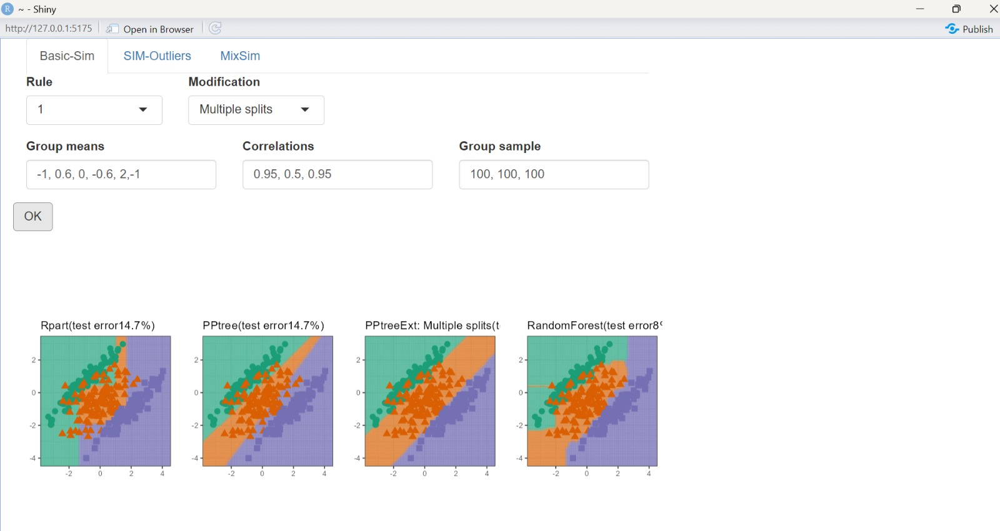
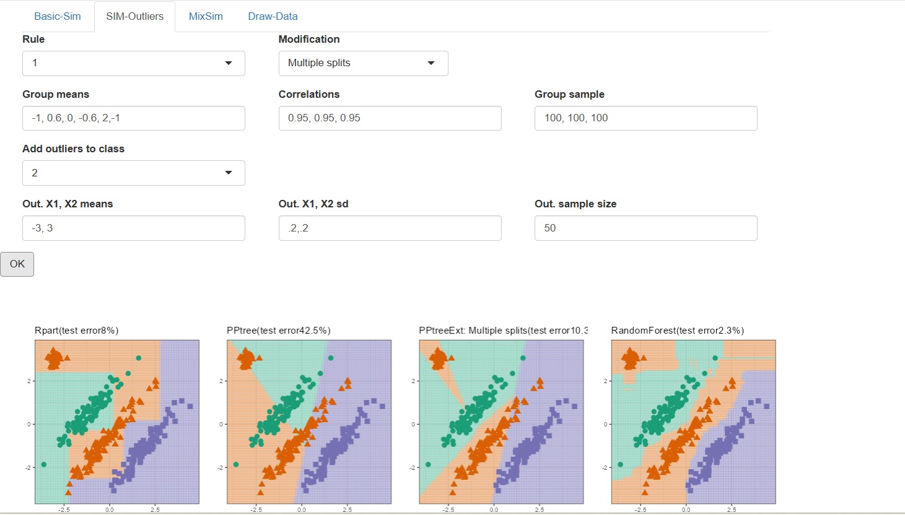
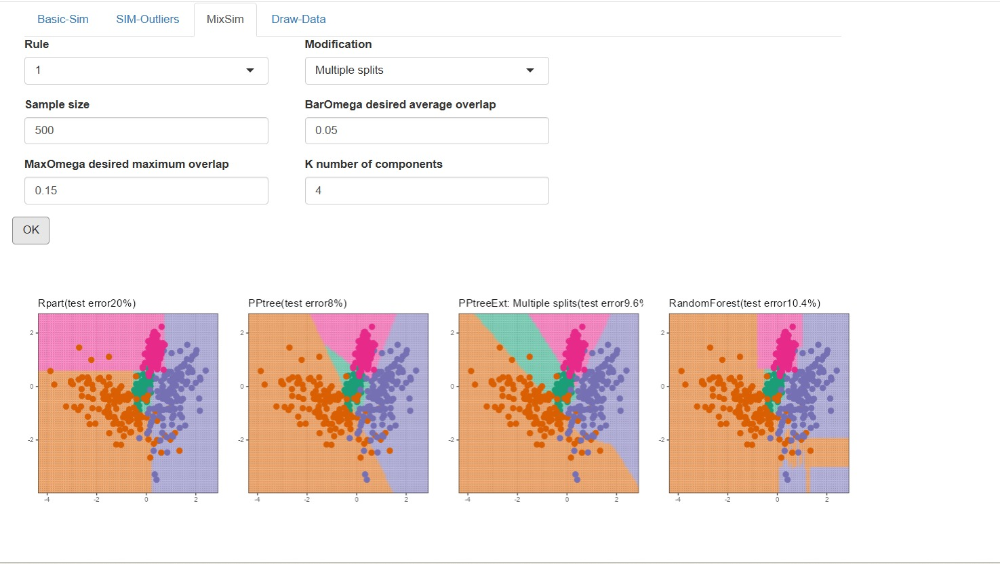

# Easy Test: RandomForest as 4th Classifier

**PR Link:** [natydasilva/classbound#5](https://github.com/natydasilva/classbound/pull/5)

## Overview

Added RandomForest as a 4th classification method to all three tabset panels (Basic-Sim, SIM-Outliers, MixSim) in `explorapp()`.

## Implementation

- Added `RF` method in `ppbound()` function using the `randomForest` package
- Each panel now shows 4 plots side by side: Rpart, PPtree, PPtreeExt, RandomForest
- Updated all 3 `grid.arrange()` calls with `ncol=4`

## Screenshots

### Basic-Sim

### SIM-Outliers

### MixSim

