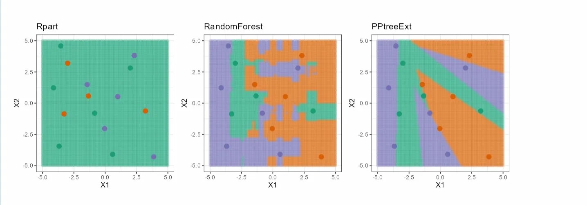

# Hard Test: Draw-Data Interactive Boundary Exploration

**PR Link:** [natydasilva/classbound#4](https://github.com/natydasilva/classbound/pull/4)

## Overview

This project completes the **Hard** GSoC Evaluation task for the `classbound` package by introducing a new **Draw-Data** tabset panel to the `explorapp()` Shiny application.

The motivation for this feature is to allow users to interactively draw their own 2D geometric datasets (such as spirals, crescents, or non-linear intersections) using the mouse, label them by class, and immediately compare how different algorithms partition the drawn space.

This enables dynamic, hands-on visual exploration of decision boundary behaviors beyond what simple simulated Gaussian parameters can provide.

---

## Implementation Details

### UI Design

- A new `tabPanel("Draw-Data", ...)` was inserted into the main `explorapp()` interface.
- Includes a dedicated `plotOutput` canvas (400x400) hooked to Shiny's `click` event listener.
- Provides interactive controls:
  - Class selector (`sim1`, `sim2`, `sim3`)
  - Rule and Modification model parameter dropdowns
  - **"Classify"** button to evaluate models on the drawn points
  - **"Clear"** button to wipe the workspace and start fresh

### Server Logic

- **Reactives:** Utilizes `shiny::reactiveValues` to incrementally append `(Sim, X1, X2)` rows to a dataset every time the user clicks on the canvas.
- **Auto-Jittering Test Data:** When "Classify" is pressed, the app samples 25% of the drawn points and adds Gaussian noise (`stats::rnorm(n_test, sd = 0.1)`) to generate out-of-sample data points that fill the surrounding regions, creating the dense boundary mesh.
- **Robust Model Evaluation:** Because hand-drawn datasets can easily be degenerate (too few points, perfectly collinear, etc.), the integration of the four standard classifiers (`rpart`, `PPtree`, `PPtreeExt: Subsetting classes`, and `PPtreeExt: Multiple splits`) was wrapped in custom `tryCatch` blocks.
  - If a method fails (e.g., PPtree throws a rank deficiency error due to an extremely sparse draw), the application safely intercepts the crash and renders a graceful inline error message for that specific model pane, allowing the other robust models to finish computing.

---

## Results & Visual Proof



---

## How to Test

1. Launch the application:
```r
devtools::load_all()
explorapp()
```

2. Navigate to the **Draw-Data** tab.
3. Select `sim1` from the dropdown and click on the blank canvas multiple times to create your first class.
4. Switch to `sim2` or `sim3` and draw the remaining classes. *(You need at least 6 points and 2 classes minimum.)*
5. Click **Classify** and wait a moment for the models to calculate and render the decision boundaries at the bottom of the screen.

