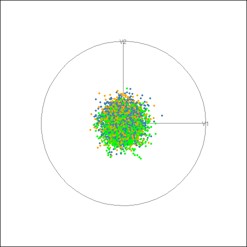
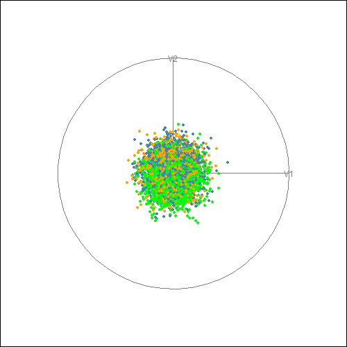

# Medium Test: Grand Tour Boundary Comparison

## Overview
This test compares the decision boundaries of rpart (CART) and PPtreeExt classifiers 
on the `data69_1` (waveform) dataset using grand tour visualization from the `tourr` package.

The goal is to reproduce Figure 11b and 11c from the paper 
**An Enhanced Projection Pursuit Tree Classifier with Visual Methods for Assessing Algorithmic Improvements**,
which demonstrates that PPtreeExt produces cleaner oblique boundaries compared to 
rparts boxy axis-aligned splits.

Reference: **Chapter 15 - Trees and Forests** from 
Interactively Exploring High-Dimensional Data and Models in R
(https://dicook.github.io/mulgar_book/15-forests.html)

## Dataset
- **data69_1** (waveform database generator): 5,000 observations, 21 numerical features, 3 classes
- Available in the `classbound` package as `data69_1`

## Method
Two classification models are fitted on the full 21-dimensional data:
- **rpart**: CART decision tree - makes axis-aligned splits
- **PPtreeExt**: Enhanced projection pursuit tree - makes oblique splits using linear combinations of variables

A grand tour from the `tourr` package is then used to animate 2D projections of the 
high-dimensional space, with points colored by each models predicted class.

## Key Findings
- PPtreeExt produces clean, oblique decision boundaries that respect the natural geometry of the class clusters
- rpart produces boxy, axis-aligned boundaries that are visibly messier
- This confirms the papers finding: PPtreeExt outperforms rpart on data where the best 
  separation between groups is in oblique directions

## rpart Grand Tour
Points colored by rpart predicted class across random 2D projections.



## PPtreeExt Grand Tour
Points colored by PPtreeExt predicted class across random 2D projections.



## How to Run
```r
library(classbound)
library(tourr)
library(PPtreeExt)
library(rpart)
library(gifski)

data(data69_1)
X <- as.matrix(data69_1[, -1])
Y <- as.factor(data69_1$Y)

# Fit models
rpart_mod <- rpart::rpart(Y ~ ., data = data.frame(Y, X))
rpart_pred <- predict(rpart_mod, type = "class")

pptree_mod <- PPtreeExt::PPtreeExtclass(Y ~ ., data = data.frame(Y, X), PPmethod = "LDA")
pptree_pred <- as.factor(predict(pptree_mod, newdata = X)[[2]])

# Animate grand tours
tourr::animate(X, tourr::grand_tour(), tourr::display_xy(
  col = c("orange","steelblue","green")[as.integer(rpart_pred)], pch = 20))
```

